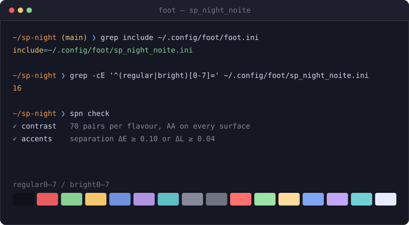
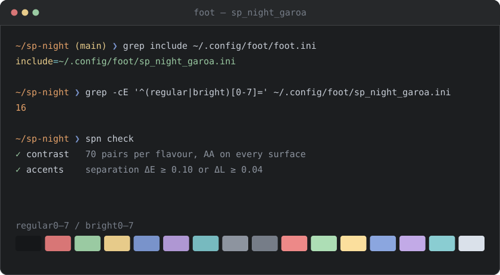
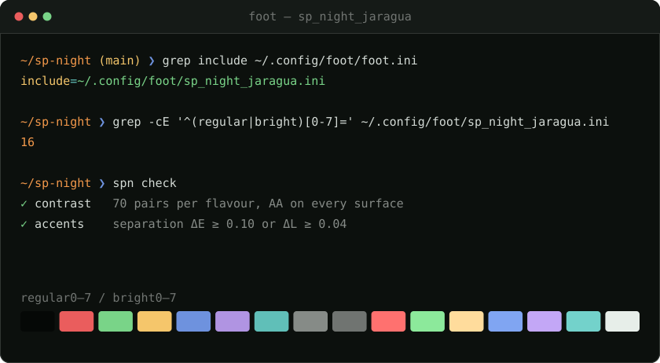

<p align="center">
  <a href="https://sp-night.github.io">
    
  </a>
</p>

<h1 align="center">SP Night for <a href="https://codeberg.org/dnkl/foot">Foot</a></h1>

<p align="center">
  <strong>The sodium lamp turns the whole city this colour.</strong><br>
  A dark colour scheme with São Paulo as its reference — the sodium street lamp,<br>
  exposed concrete, the free span of the MASP, the drizzle before the rain.
</p>

<p align="center">
  <a href="https://sp-night.github.io"><strong>sp-night.github.io</strong></a>
  &nbsp;·&nbsp;
  <a href="https://sp-night.github.io/palette">palette</a>
  &nbsp;·&nbsp;
  <a href="https://sp-night.github.io/spec">spec</a>
  &nbsp;·&nbsp;
  <a href="https://sp-night.github.io/ports">ports</a>
</p>

---

## The flavours

All three are dark, by decision. The previews below are synthetic — drawn from the
palette itself, so they can never drift from what you install.

### Noite Paulista — `sp_night_noite.ini`

The city at 3am. Blue-violet dark, the sodium lamp burning warm on top.



### Garoa — `sp_night_garoa.ini`

The same window, seen through the drizzle. Flat grey — the garoa does not cool
the city down, it washes it out.



### Pico do Jaraguá — `sp_night_jaragua.ini`

The same night, seen from the city's highest point. Near-black surfaces, with
the forest left to the accents — and the red-and-white tower lit at the summit.



## Install

foot reads a theme through an `include` in its own `foot.ini`, so the file
goes next to it and nothing overwrites it.

Grab the flavour you want (or all three):

```sh
mkdir -p ~/.config/foot
curl -Lo ~/.config/foot/sp_night_noite.ini \
  https://raw.githubusercontent.com/sp-night/foot/main/themes/sp_night_noite.ini
```

Then add the include to `~/.config/foot/foot.ini`:

```ini
include=~/.config/foot/sp_night_noite.ini
```

foot does not reload its configuration, so open a new window — or, with a
server running, restart `foot --server`.

> [!NOTE]
> The theme sets `[colors-dark]`, which replaced `[colors]` in foot 1.26.
> The included file keeps its own section scope, so the `include` line can
> sit anywhere in `foot.ini`. A `[colors-dark]` of your own that comes
> after it still wins, key by key.

Prefer a checkout? Clone and copy — the files are plain text, there is no build:

```sh
git clone https://github.com/sp-night/foot.git
cp foot/themes/*.ini ~/.config/foot/
```

Some keys the theme deliberately leaves alone, for one reason: this project
does not ship a colour nobody measured.

`dim0`…`dim7` are absent. The palette has no measured dim set, and foot
derives faint text by blending on its own.

The 256-colour palette above 15 and the sixel palette are absent too: they
are xterm's standard cube, not a place for a colour scheme.

`alpha`, `flash-alpha` and the `[csd]` title bar are behaviour and window
decoration rather than terminal colour. Set them in your own config.

## What gets themed

| Foot key | Role | Meaning |
|---|---|---|
| `regular0…7` / `bright0…7` | `ansi.*` | the full 16-colour ANSI mapping |
| `background` / `foreground` | `ui.bg` / `ui.fg` | *laje* under the main text |
| `cursor` | `ui.on_accent` / `ui.cursor` | the *sódio* cursor, dark text inside it |
| `selection-background` / `-foreground` | `ui.selection` / `ui.fg` | *vidro*, glass reflecting the street |
| `urls` | `ui.link` | the URL-mode underline in *marginal*, the expressway sign |
| `jump-labels` | `ui.on_accent` / `ui.accent` | the key to press next is loud, dark text on the signature colour |
| `search-box-match` | `ui.on_accent` / `ui.match` | a search that finds something sits in *táxi*, the colour this theme uses for a match |
| `search-box-no-match` | `ui.on_accent` / `diagnostic.error` | a search that finds nothing turns to *brasa* — an error, not an accent |
| `scrollback-indicator` | `ui.fg_dim` / `ui.bg_deep` | the position readout recedes into the *vão* |
| `flash` | `diagnostic.warn` | a bell is a warning, not an accent |

No hex in this repo was picked by hand. Every value comes from the
[SP Night palette](https://sp-night.github.io/palette) through its role layer,
both published as data:
[`palette.json`](https://sp-night.github.io/palette.json) and
[`roles.json`](https://sp-night.github.io/roles.json). The contrast floors those
colours have to clear are [written down in the spec](https://sp-night.github.io/spec)
and enforced in CI.

## The mapping

[`foot.ini.tmpl`](foot.ini.tmpl) is the full record of which Foot key means which
role — the table above in complete form. The files in
[`themes/`](themes) are what it resolves to, one per flavour.

You never need it to use the theme: the shipped files are plain text and final.
It is here so the mapping survives, and so a retuned palette can be rolled
through this port without anyone re-deciding what the search box turning red means.

## License

[MIT](LICENSE)
